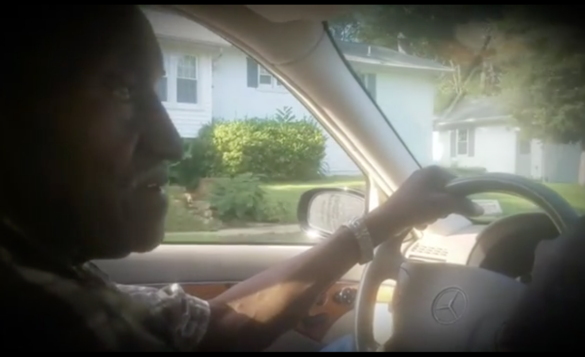
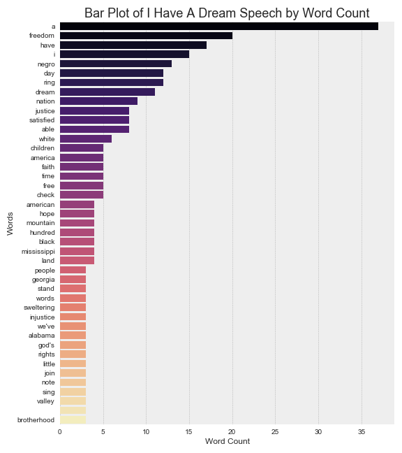

Let’s rewind to the summer of 2000. I was eighteen at the time. This summer, my grandfather and I decided to take a road trip back to his hometown of Little Rock, Arkansas. First, we went to the gas station and filled up with gas goodies: chips, beef jerky, and a few bottles of pop. Although we have taken this trip before, this time was different.

My grandfather, Curley Hines, started talking about his childhood(I don’t want to leave out the Marvin Gaye playing in the background). While I was eating my chips and drinking my pop, he said, “BJ, you will have it a lot easier than me.” I didn’t understand him so I told him to explain. He said it was tough growing up in 50’s, 60’s, and 70’s.
So, he headed north to St.Louis, leaving his mother for better career opportunities and a better life. He told me about the civil rights movement and the fight for equality in America. One of the key figures in the civil rights movement was Martin Luther King Jr., whose speeches and quotes have become deeply embedded in American History.
“The time is always right to do what is right.” ~ Martin Luther King Jr.

Later my grandfather started telling me when times get hard, always do what is right and never give up. He actually said it a little differently by stressing the importance of integrity. He warned me that everyone faces obstacles in life, but each individual will have to be strong, deal with them the situation, and overcome. So, now I sit in my apartment in Austin, Texas, realizing he was right. I often wonder how different America might be if King did not stand up in Washington D.C., on August 28, 1963, and give the famous I HAVE A DREAM SPEECH. In this speech, King called for an end to all inequalities in America and talked about economic rights. So, Let’s explore this famous speech.

I have removed all stop words. Stop words are the words not significant in the chosen exploratory data analysis. Also, I used natural language processing in an attempt to analyze, understand, and make sense of this speech. Next, I removed all words that did not appear more than 3 times in this speech. The tools used for this EDA are Pandas, Tableau, Python, and VaderSentiment.

As you can see, King stresses the importance of freedom, justice, hope, and more. Next. I used the VaderSentiment library to perform a sentiment analysis on the famous, “I have a dream” quote. Now, let’s analyze the compound, positive, negative, and neutral scores for this quote. After performing a Vader Sentiment Analysis on this famous quote, the scores for the compound, positive, neutral, and negative scores are .25,.67,.33, and 0, respectively. This means I HAVE A DREAM is an extremely positive statement.

link to medium post https://medium.com/@bltxr9/exploratory-data-analysis-on-i-have-a-dream-speech-9e21b8e8fc78
